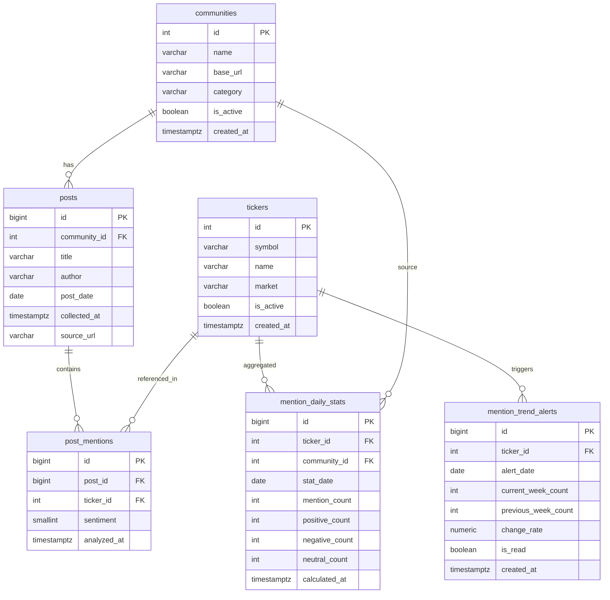
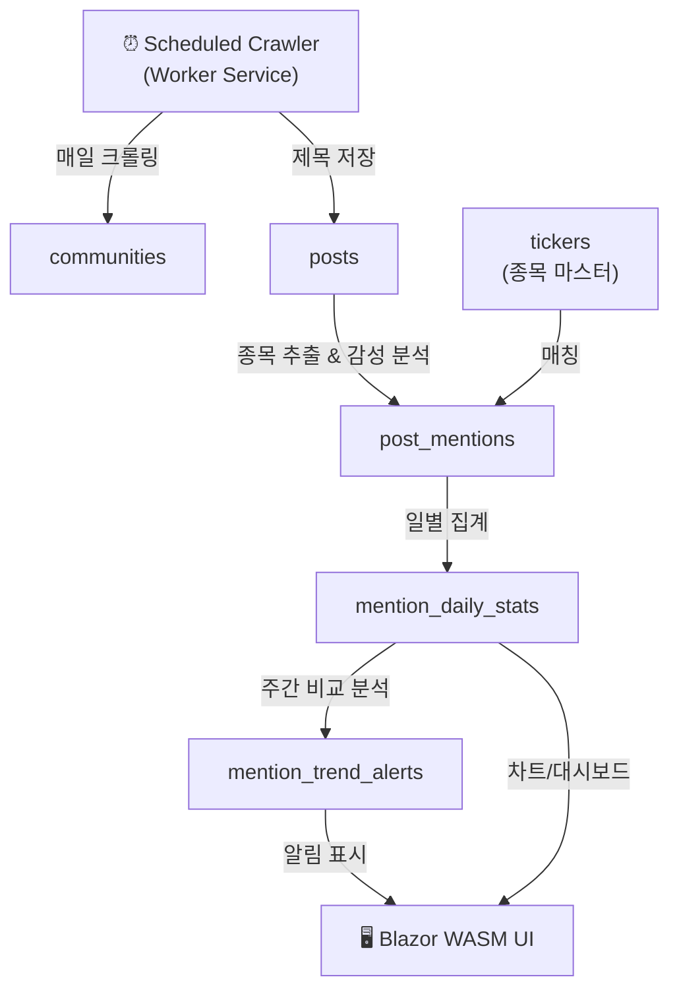

# Human Index - Database Schema

> PostgreSQL 기반 커뮤니티 주식 언급량 분석 시스템의 데이터베이스 스키마 설계 문서

---

## ER Diagram



---

## Tables

### 1. `communities` — 크롤링 대상 커뮤니티

크롤링 대상이 되는 커뮤니티 사이트 정보를 관리한다.

| Column | Type | Constraint | Description |
|--------|------|------------|-------------|
| `id` | `SERIAL` | `PK` | 커뮤니티 고유 ID |
| `name` | `VARCHAR(100)` | `NOT NULL, UNIQUE` | 커뮤니티 이름 (예: 디시인사이드, 네이버 카페 등) |
| `base_url` | `VARCHAR(500)` | `NOT NULL` | 크롤링 대상 기본 URL |
| `category` | `VARCHAR(100)` | | 크롤링 대상 카테고리 (예: 주식, 해외주식) |
| `is_active` | `BOOLEAN` | `NOT NULL DEFAULT TRUE` | 크롤링 활성 여부 |
| `created_at` | `TIMESTAMPTZ` | `NOT NULL DEFAULT NOW()` | 등록 일시 |

---

### 2. `posts` — 크롤링된 게시글 제목

> **시나리오 1** — 매일 정해진 시간에 커뮤니티에서 제목만 추출하여 저장

커뮤니티에서 수집된 게시글의 메타 정보(제목, 작성자, 날짜)를 저장한다. 본문은 저장하지 않는다.

| Column | Type | Constraint | Description |
|--------|------|------------|-------------|
| `id` | `BIGSERIAL` | `PK` | 게시글 고유 ID |
| `community_id` | `INTEGER` | `NOT NULL, FK → communities.id` | 출처 커뮤니티 |
| `title` | `TEXT` | `NOT NULL` | 게시글 제목 (full text) |
| `author` | `VARCHAR(200)` | | 작성자 |
| `post_date` | `DATE` | `NOT NULL` | 게시글 작성일 |
| `collected_at` | `TIMESTAMPTZ` | `NOT NULL DEFAULT NOW()` | 수집 일시 |
| `source_url` | `VARCHAR(1000)` | | 원본 게시글 URL (중복 수집 방지용) |

**Indexes:**
- `ix_posts_community_date` — `(community_id, post_date)` : 커뮤니티별 일자 조회
- `ix_posts_post_date` — `(post_date)` : 날짜 기반 조회
- `uq_posts_source_url` — `UNIQUE(source_url)` : 중복 수집 방지

---

### 3. `tickers` — 종목 마스터

> **시나리오 2** — ticker를 별도로 DB화

분석 대상 종목(ticker) 정보를 관리한다.

| Column | Type | Constraint | Description |
|--------|------|------------|-------------|
| `id` | `SERIAL` | `PK` | 종목 고유 ID |
| `symbol` | `VARCHAR(20)` | `NOT NULL, UNIQUE` | 종목 코드 (예: 005930, AAPL) |
| `name` | `VARCHAR(200)` | `NOT NULL` | 종목명 (예: 삼성전자, Apple Inc.) |
| `market` | `VARCHAR(20)` | `NOT NULL DEFAULT 'KRX'` | 시장 구분 (KRX, NASDAQ, NYSE 등) |
| `is_active` | `BOOLEAN` | `NOT NULL DEFAULT TRUE` | 활성 여부 |
| `created_at` | `TIMESTAMPTZ` | `NOT NULL DEFAULT NOW()` | 등록 일시 |

**Indexes:**
- `ix_tickers_name` — `(name)` : 종목명 검색용

> [!TIP]
> 종목 매칭 시 `symbol`뿐 아니라 `name` 기반으로도 매칭해야 하므로, 별칭(alias) 테이블을 추후 추가하는 것을 고려할 수 있다. (예: "삼전" → "삼성전자")

---

### 4. `post_mentions` — 게시글별 종목 언급 & 감성 분석

> **시나리오 2** — 제목에서 종목을 추출하고 긍정/부정/중립을 판별

게시글 제목에서 추출된 종목 언급과 해당 감성(sentiment) 분석 결과를 저장한다.

| Column | Type | Constraint | Description |
|--------|------|------------|-------------|
| `id` | `BIGSERIAL` | `PK` | 고유 ID |
| `post_id` | `BIGINT` | `NOT NULL, FK → posts.id` | 게시글 참조 |
| `ticker_id` | `INTEGER` | `NOT NULL, FK → tickers.id` | 언급된 종목 |
| `sentiment` | `SMALLINT` | `NOT NULL DEFAULT 0` | 감성 분석 결과: `1` 긍정 / `-1` 부정 / `0` 중립 |
| `analyzed_at` | `TIMESTAMPTZ` | `NOT NULL DEFAULT NOW()` | 분석 일시 |

**Indexes:**
- `ix_post_mentions_ticker` — `(ticker_id)` : 종목별 언급 조회
- `ix_post_mentions_post` — `(post_id)` : 게시글별 언급 조회
- `uq_post_mentions_post_ticker` — `UNIQUE(post_id, ticker_id)` : 동일 게시글-종목 중복 방지

---

### 5. `mention_daily_stats` — 일별 종목 언급 통계

일별/커뮤니티별 종목 언급 수와 감성 분포를 집계한 테이블. 트렌드 분석의 기반 데이터.

| Column | Type | Constraint | Description |
|--------|------|------------|-------------|
| `id` | `BIGSERIAL` | `PK` | 고유 ID |
| `ticker_id` | `INTEGER` | `NOT NULL, FK → tickers.id` | 종목 |
| `community_id` | `INTEGER` | `FK → communities.id` | 커뮤니티 (NULL이면 전체 합산) |
| `stat_date` | `DATE` | `NOT NULL` | 집계 날짜 |
| `mention_count` | `INTEGER` | `NOT NULL DEFAULT 0` | 총 언급 수 |
| `positive_count` | `INTEGER` | `NOT NULL DEFAULT 0` | 긍정 언급 수 |
| `negative_count` | `INTEGER` | `NOT NULL DEFAULT 0` | 부정 언급 수 |
| `neutral_count` | `INTEGER` | `NOT NULL DEFAULT 0` | 중립 언급 수 |
| `calculated_at` | `TIMESTAMPTZ` | `NOT NULL DEFAULT NOW()` | 집계 일시 |

**Indexes:**
- `uq_mention_daily_stats` — `UNIQUE(ticker_id, community_id, stat_date)` : 중복 집계 방지
- `ix_mention_daily_stats_date` — `(stat_date)` : 날짜 기반 조회

---

### 6. `mention_trend_alerts` — 트렌드 알림

> **시나리오 3** — 전주 대비 언급량 증가 종목 알림

주간 언급량 변화를 감지하여 생성된 알림 정보를 저장한다.

| Column | Type | Constraint | Description |
|--------|------|------------|-------------|
| `id` | `BIGSERIAL` | `PK` | 고유 ID |
| `ticker_id` | `INTEGER` | `NOT NULL, FK → tickers.id` | 종목 |
| `alert_date` | `DATE` | `NOT NULL` | 알림 발생일 |
| `current_week_count` | `INTEGER` | `NOT NULL` | 금주 언급 수 |
| `previous_week_count` | `INTEGER` | `NOT NULL` | 전주 언급 수 |
| `change_rate` | `NUMERIC(10,4)` | `NOT NULL` | 변화율 (예: 1.5 = 150% 증가) |
| `is_read` | `BOOLEAN` | `NOT NULL DEFAULT FALSE` | 읽음 여부 (UI 알림 표시용) |
| `created_at` | `TIMESTAMPTZ` | `NOT NULL DEFAULT NOW()` | 알림 생성 일시 |

**Indexes:**
- `ix_trend_alerts_ticker_date` — `(ticker_id, alert_date)` : 종목별 알림 조회
- `ix_trend_alerts_unread` — `(is_read) WHERE is_read = FALSE` : 미읽은 알림 조회 (partial index)

---

## Data Flow



---

## DDL

```sql
-- =============================================
-- Human Index - Database Schema DDL
-- PostgreSQL 15+
-- =============================================

-- 1. communities
CREATE TABLE communities (
    id          SERIAL          PRIMARY KEY,
    name        VARCHAR(100)    NOT NULL UNIQUE,
    base_url    VARCHAR(500)    NOT NULL,
    category    VARCHAR(100),
    is_active   BOOLEAN         NOT NULL DEFAULT TRUE,
    created_at  TIMESTAMPTZ     NOT NULL DEFAULT NOW()
);

-- 2. posts
CREATE TABLE posts (
    id              BIGSERIAL       PRIMARY KEY,
    community_id    INTEGER         NOT NULL REFERENCES communities(id),
    title           TEXT            NOT NULL,
    author          VARCHAR(200),
    post_date       DATE            NOT NULL,
    collected_at    TIMESTAMPTZ     NOT NULL DEFAULT NOW(),
    source_url      VARCHAR(1000)
);

CREATE INDEX ix_posts_community_date ON posts (community_id, post_date);
CREATE INDEX ix_posts_post_date ON posts (post_date);
CREATE UNIQUE INDEX uq_posts_source_url ON posts (source_url) WHERE source_url IS NOT NULL;

-- 3. tickers
CREATE TABLE tickers (
    id          SERIAL          PRIMARY KEY,
    symbol      VARCHAR(20)     NOT NULL UNIQUE,
    name        VARCHAR(200)    NOT NULL,
    market      VARCHAR(20)     NOT NULL DEFAULT 'KRX',
    is_active   BOOLEAN         NOT NULL DEFAULT TRUE,
    created_at  TIMESTAMPTZ     NOT NULL DEFAULT NOW()
);

CREATE INDEX ix_tickers_name ON tickers (name);

-- 4. post_mentions
CREATE TABLE post_mentions (
    id          BIGSERIAL       PRIMARY KEY,
    post_id     BIGINT          NOT NULL REFERENCES posts(id) ON DELETE CASCADE,
    ticker_id   INTEGER         NOT NULL REFERENCES tickers(id),
    sentiment   SMALLINT        NOT NULL DEFAULT 0,
    analyzed_at TIMESTAMPTZ     NOT NULL DEFAULT NOW(),
    CONSTRAINT uq_post_mentions_post_ticker UNIQUE (post_id, ticker_id)
);

CREATE INDEX ix_post_mentions_ticker ON post_mentions (ticker_id);
CREATE INDEX ix_post_mentions_post ON post_mentions (post_id);

COMMENT ON COLUMN post_mentions.sentiment IS '1: 긍정, -1: 부정, 0: 중립';

-- 5. mention_daily_stats
CREATE TABLE mention_daily_stats (
    id              BIGSERIAL       PRIMARY KEY,
    ticker_id       INTEGER         NOT NULL REFERENCES tickers(id),
    community_id    INTEGER         REFERENCES communities(id),
    stat_date       DATE            NOT NULL,
    mention_count   INTEGER         NOT NULL DEFAULT 0,
    positive_count  INTEGER         NOT NULL DEFAULT 0,
    negative_count  INTEGER         NOT NULL DEFAULT 0,
    neutral_count   INTEGER         NOT NULL DEFAULT 0,
    calculated_at   TIMESTAMPTZ     NOT NULL DEFAULT NOW()
);

CREATE UNIQUE INDEX uq_mention_daily_stats
    ON mention_daily_stats (ticker_id, COALESCE(community_id, 0), stat_date);
CREATE INDEX ix_mention_daily_stats_date ON mention_daily_stats (stat_date);

-- 6. mention_trend_alerts
CREATE TABLE mention_trend_alerts (
    id                  BIGSERIAL       PRIMARY KEY,
    ticker_id           INTEGER         NOT NULL REFERENCES tickers(id),
    alert_date          DATE            NOT NULL,
    current_week_count  INTEGER         NOT NULL,
    previous_week_count INTEGER         NOT NULL,
    change_rate         NUMERIC(10,4)   NOT NULL,
    is_read             BOOLEAN         NOT NULL DEFAULT FALSE,
    created_at          TIMESTAMPTZ     NOT NULL DEFAULT NOW()
);

CREATE INDEX ix_trend_alerts_ticker_date ON mention_trend_alerts (ticker_id, alert_date);
CREATE INDEX ix_trend_alerts_unread ON mention_trend_alerts (is_read) WHERE is_read = FALSE;
```

---

## Design Decisions

> [!NOTE]
> ### 왜 본문(content)을 저장하지 않는가?
> GEMINI.md 시나리오에 명시된 대로, 언급량 분석이 목적이므로 본문은 수집하지 않는다.
> 제목만으로 종목 추출 및 감성 분석을 수행하여 스토리지 비용을 최소화한다.

> [!NOTE]
> ### sentiment를 SMALLINT로 관리하는 이유
> ENUM 대신 `SMALLINT(-1, 0, 1)`를 사용하면 집계 시 `SUM()`으로 전체 감성 점수를 산출할 수 있고,
> 추후 감성 강도(예: -2 ~ +2)로 확장하기도 용이하다.

> [!NOTE]
> ### mention_daily_stats의 community_id가 nullable인 이유
> `community_id = NULL`인 행은 전체 커뮤니티 합산 통계를 나타낸다.
> 커뮤니티별 통계와 전체 통계를 하나의 테이블에서 관리하여 쿼리를 단순화한다.

> [!IMPORTANT]
> ### 향후 확장 고려 사항
> - **ticker_aliases 테이블**: "삼전" → "삼성전자" 같은 별칭 매핑 지원
> - **crawl_logs 테이블**: 크롤링 실행 이력 및 에러 로그 관리
> - **price_data 테이블**: 주가 데이터 연동 시 언급량-주가 상관관계 분석 지원
