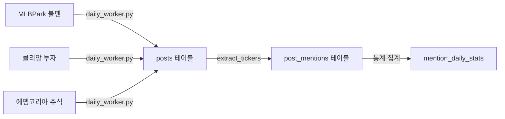
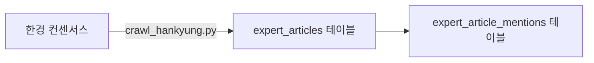

# Human Index - 프로젝트 구조

> 커뮤니티 언급량 기반 주식 투자 시그널 분석 플랫폼

## 개요

커뮤니티에서 언급되는 종목을 크롤링하여 DB화하고, **대중 의견(커뮤니티)**과 **전문가 의견(증권사 리포트/뉴스)**을 교차 분석하여 투자 시그널을 제공합니다.

### 핵심 시나리오

1. **데이터 수집**: 커뮤니티/증권사 리포트/뉴스 기사에서 게시글 제목 수집
2. **종목 추출 & 감성 분석**: 제목에서 종목을 추출하고 긍정/부정/중립 판정
3. **트렌드 분석**: 전주 대비 언급량 급상승 종목 감지, 대중 vs 전문가 감성 괴리 분석

### 기술 스택

| 구분 | 기술 |
|------|------|
| 대시보드 | Python + Streamlit (Streamlit Cloud 배포) |
| 데이터베이스 | PostgreSQL (Supabase 클라우드) |
| 크롤링 | Python (requests + BeautifulSoup + RSS) |
| 스케줄링 | **GitHub Actions** (주력) + macOS launchd (백업) |

### 배포 현황

| 서비스 | URL |
|--------|-----|
| 대시보드 | [human-index.streamlit.app](https://human-index-fbsfdag8sk7hcpfedhrm9h.streamlit.app/) |
| DB | Supabase (서울 리전) |
| 크롤러 자동화 | GitHub Actions (24/7 무중단) |

---

## 디렉토리 구조

```
human-index/
│
├── app.py                              # Streamlit 앱 진입점 (사이드바 + 라우팅)
│
├── lib/                                # 대시보드 페이지 모듈
│   ├── __init__.py
│   ├── shared.py                       # 공통: DB, 쿼리, 페이지네이션, 차트 헬퍼
│   ├── community.py                    # 📢 커뮤니티 페이지 (5개)
│   ├── report.py                       # 🔬 리포트 페이지 (4개)
│   ├── news.py                         # 📰 뉴스 페이지 (4개)
│   └── overview.py                     # 📊 종합 페이지 (2개)
│
├── scripts/                            # 데이터 수집 & 처리 스크립트
│   ├── db_config.py                    # DB 접속 설정 (secrets.toml → 환경변수 → 기본값)
│   ├── daily_worker.py                 # 커뮤니티 파이프라인 (크롤링 → 종목추출 → 감성분석)
│   ├── crawl_hankyung.py               # 한경 컨센서스 크롤러 (증권사 리포트)
│   ├── crawl_google_news.py            # Google News RSS 크롤러 (증권 뉴스 기사)
│   ├── crawl_mlbpark.py                # MLBPark 크롤러 (일일 모드)
│   ├── crawl_mlbpark_bulk.py           # MLBPark 벌크 크롤러 (초기 데이터 수집)
│   ├── extract_tickers.py              # 종목 추출 & 감성 분석
│   ├── import_tickers.py               # KRX/US 종목 마스터 임포트
│   └── recrawl_bulk.py                 # 벌크 재수집 (일회성)
│
├── .github/workflows/                  # GitHub Actions 크롤러 자동화
│   ├── crawl-community.yml             # 커뮤니티 크롤러 (1시간마다)
│   ├── crawl-hankyung.yml              # 한경 리포트 크롤러 (평일 18:30)
│   └── crawl-google-news.yml           # Google News 크롤러 (6시간마다)
│
├── docs/                               # 문서
│   ├── project-structure.md            # 프로젝트 구조 (이 문서)
│   ├── db-schema.md                    # 데이터베이스 스키마 설계
│   ├── deployment-guide.md             # 클라우드 배포 가이드
│   └── init-db.sql                     # DB 초기화 SQL
│
├── logs/                               # 크롤링 로그
│
├── .streamlit/
│   └── secrets.toml                    # DB 접속 정보 (git 제외)
│
├── requirements.txt                    # Python 의존성
└── .python-version                     # Python 3.11 고정
```

---

## 대시보드 페이지 구성

> 모든 테이블은 25건 단위 페이지네이션 적용. 기간 선택은 **일간/주간/월간/연간** 탭 UI.

### 사이드바 메뉴 순서

**종합** → **커뮤니티** → **리포트** → **뉴스** (종합 대시보드가 첫 화면)

### 🏠 종합 (교차 분석) — `lib/overview.py`

| 페이지 | 함수 | 설명 |
|--------|------|------|
| 🏠 종합 대시보드 | `page_dashboard` | KPI, 채널별 TOP 10 (커뮤니티/리포트/뉴스) |
| 🔍 종목 검색 | `page_ticker_search` | 채널별 수치 비교 + 3채널 트렌드 차트 (집계 단위 탭) |

### 📢 커뮤니티 (대중 의견) — `lib/community.py`

| 페이지 | 함수 | 설명 |
|--------|------|------|
| 📈 커뮤니티 개요 | `page_overview` | KPI, 감성 추이 차트, TOP 10 종목 |
| 📊 언급량 랭킹 | `page_mention_ranking` | 종목별 언급 수, 감성 비율, 가중 점수 (기간탭) |
| 🚀 급상승 랭킹 | `page_surge_ranking` | 전기 대비 언급량 변화 (일간/주간/월간/연간) |
| 👤 작성자 랭킹 | `page_author_ranking` | 활발한 작성자 순위 |
| 📋 게시글 목록 | `page_post_list` | 커뮤니티 필터, 제목 검색, 종목 필터, DB 페이징 |

### 🔬 리포트 (증권사 리포트) — `lib/report.py`

| 페이지 | 함수 | 설명 |
|--------|------|------|
| 📈 리포트 개요 | `page_overview` | KPI, 투자의견 추이, TOP 10 커버 종목 |
| 📊 리포트 랭킹 | `page_report_ranking` | 종목별 리포트 수, Buy/Hold/Sell 분포 (기간탭) |
| 🚀 리포트 급상승 | `page_surge_ranking` | 전기 대비 리포트 언급 변화 |
| 📋 리포트 목록 | `page_report_list` | 증권사 필터, 제목 검색, DB 페이징 |

### 📰 뉴스 (Google News) — `lib/news.py`

| 페이지 | 함수 | 설명 |
|--------|------|------|
| 📈 뉴스 개요 | `page_overview` | KPI, 감성 추이 차트, TOP 10 종목 |
| 📊 뉴스 언급량 랭킹 | `page_mention_ranking` | 종목별 언급 수, 감성 비율 (기간탭) |
| 🚀 뉴스 급상승 | `page_surge_ranking` | 전기 대비 뉴스 언급 변화 |
| 📋 뉴스 목록 | `page_article_list` | 제목 검색, DB 페이징 |

### 🛠️ 공통 컴포넌트 — `lib/shared.py`

| 함수/상수 | 설명 |
|-----------|------|
| `run_query()` | DB 쿼리 → DataFrame (자동 재연결) |
| `paginated_dataframe()` | 25건 페이지네이션 테이블 |
| `period_tabs()` | 일간/주간/월간/연간 탭 UI |
| `render_top10_chart()` | TOP 10 수평 바 차트 (Altair) |
| `render_colored_line_chart()` | 감성 색상 적용 라인 차트 (긍정=🔵, 부정=🔴, 중립=⚪) |
| `render_surge_page()` | 급상승 랭킹 페이지 공통 로직 |

---

## 데이터 수집 파이프라인

### 커뮤니티 (대중 의견)



- **실행**: GitHub Actions — **1시간마다**
- **중복 방지**: `source_url` 기준 `ON CONFLICT DO NOTHING`
- **종료 조건**: 2연속 중복 페이지 감지 시 자동 종료

### 전문가 (증권사 리포트)



- **실행**: GitHub Actions — **평일 18:30** (장 마감 후)
- **수집 항목**: 제목, 증권사, 작성자, 목표가, 투자의견

### 뉴스 기사 (전문가 소스)


- **실행**: GitHub Actions — **6시간마다**
- **검색 키워드**: 종목분석, 실적/목표가, 반도체 전망
- **수집 항목**: 기사 제목, 언론사, 날짜

---

## 데이터베이스 구조

> 상세 스키마는 [db-schema.md](db-schema.md) 참조

### 주요 테이블

| 테이블 | 설명 | 소스 |
|--------|------|------|
| `communities` | 수집 대상 커뮤니티 | - |
| `posts` | 커뮤니티 게시글 | MLBPark, 클리앙, 에펨코리아 |
| `tickers` | 종목 마스터 | KRX, 수동 등록 |
| `post_mentions` | 게시글 내 종목 언급 + 감성 | 자동 추출 |
| `mention_daily_stats` | 일별 종목 통계 | 집계 |
| `mention_trend_alerts` | 급상승 알림 | 집계 |
| `expert_sources` | 전문가 데이터 소스 | - |
| `expert_articles` | 증권사 리포트 + 뉴스 기사 | 한경, Google News |
| `expert_article_mentions` | 리포트 내 종목 + 의견 | 자동 매칭 |

---

## 자동 실행 (GitHub Actions)

### 주력: GitHub Actions (24/7 무중단)

| 워크플로우 | 파일 | 스케줄 |
|-----------|------|--------|
| 커뮤니티 크롤러 | `crawl-community.yml` | 매 1시간 |
| 한경 리포트 크롤러 | `crawl-hankyung.yml` | 평일 18:30 (KST) |
| Google News 크롤러 | `crawl-google-news.yml` | 6시간마다 |

> **GitHub Secrets** (Settings → Secrets → Repository secrets):
> `DB_NAME`, `DB_HOST`, `DB_PORT`, `DB_USER`, `DB_PASSWORD`

### 백업: macOS launchd (로컬)

| 서비스 | 주기 | plist |
|--------|------|-------|
| 커뮤니티 크롤러 | 1시간 | `com.humanindex.daily-worker.plist` |
| 한경 리포트 | 1일 1회 | `com.humanindex.hankyung-crawler.plist` |
| Google News | 6시간 | `com.humanindex.google-news-crawler.plist` |

```bash
# launchd 등록/확인 (Mac 로컬 백업용)
launchctl load ~/Library/LaunchAgents/com.humanindex.daily-worker.plist
launchctl load ~/Library/LaunchAgents/com.humanindex.hankyung-crawler.plist
launchctl load ~/Library/LaunchAgents/com.humanindex.google-news-crawler.plist
launchctl list | grep humanindex
```

> GitHub Actions와 로컬 launchd가 동시에 돌아도 `source_url` 중복 방지로 데이터가 겹치지 않습니다.

---

## 로컬 실행

```bash
# 대시보드 실행
streamlit run app.py

# 크롤링 수동 실행
python scripts/daily_worker.py          # 커뮤니티 전체 파이프라인
python scripts/crawl_hankyung.py        # 한경 리포트 수집
python scripts/crawl_google_news.py     # Google News 뉴스 수집

# 종목 마스터 업데이트
python scripts/import_tickers.py
```

---

## 월간 사용량 예상

| 서비스 | 무료 한도 | 예상 사용량 |
|--------|----------|-----------|
| **GitHub Actions** | 2,000분/월 | ~780분 (커뮤니티 720 + 한경 40 + 뉴스 20) |
| **Supabase** | DB 500MB | ~50MB |
| **Streamlit Cloud** | 앱 1개, 1GB RAM | 충분 |
