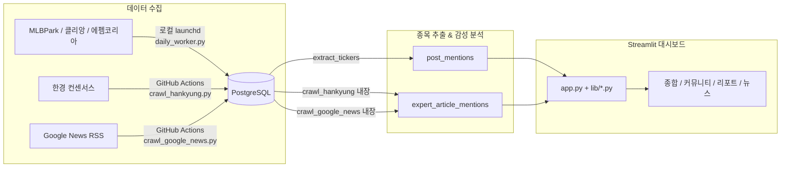
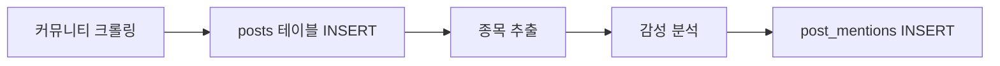
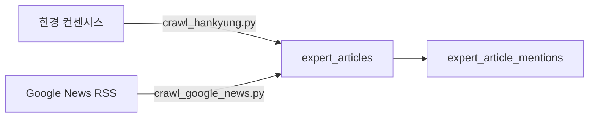

# Human Index — 프로젝트 아키텍처 & 서비스 흐름

> 커뮤니티 언급량 기반 주식 투자 시그널 분석 플랫폼

## 서비스 아키텍처

```
┌─────────────────────┐       ┌─────────────────┐       ┌─────────────────────┐
│  로컬 Mac Mini        │       │  Supabase        │       │ Streamlit Cloud     │
│  (커뮤니티 크롤러)     │       │  (PostgreSQL)    │       │  (대시보드)           │
│                     ├───────→│                 │←──────┤                     │
│ daily_worker.py     │INSERT  │  posts           │SELECT  │  app.py             │
│                     │       │  *_mentions      │       │  lib/*.py           │
└─────────────────────┘       └─────────────────┘       └─────────────────────┘
┌─────────────────────┐
│  GitHub Actions      │
│  (리포트/뉴스 크롤러)  │INSERT
│                     ├───────→ Supabase
│ crawl_hankyung.py   │
│ crawl_google_news.py│
└─────────────────────┘
   리포트: 평일 1회          클라우드 DB                human-index.
   뉴스: 6시간마다                                       streamlit.app
```

### 서비스 흐름



1. **수집**: 로컬 launchd(커뮤니티) + GitHub Actions(리포트/뉴스)가 크롤러를 실행하여 게시글/리포트/뉴스 **제목**을 수집 → DB 저장
2. **처리**: 제목에서 종목(ticker)을 자동 추출하고, 키워드 기반 긍정/부정/중립 감성 판정
3. **분석**: Streamlit 대시보드에서 언급량 랭킹, 급상승 감지, 채널별 교차 분석 제공

---

## 기술 스택

| 구분 | 기술 |
|------|------|
| 대시보드 | Python + Streamlit → Streamlit Cloud |
| 데이터베이스 | PostgreSQL → Supabase (서울 리전) |
| 크롤링 | Python (requests + BeautifulSoup + RSS XML) |
| 스케줄링 | macOS launchd (커뮤니티) + GitHub Actions (리포트/뉴스) |
| 스타일 | CSS 외부 파일 (`static/style.css`) |
| 분석 | Google Analytics (GA4) |

---

## 디렉토리 구조

```
human-index/
│
├── app.py                              # 앱 진입점: CSS 로딩, 사이드바, 페이지 라우팅
│
├── static/
│   └── style.css                       # 전역 CSS (메트릭 카드, 사이드바, 페이지네이션 등)
│
├── lib/                                # 대시보드 페이지 모듈
│   ├── __init__.py
│   ├── shared.py                       # 공통: DB, 쿼리, UI 헬퍼, 상수
│   ├── community.py                    # 📢 커뮤니티 (4페이지 + 작성자 랭킹)
│   ├── report.py                       # 🔬 리포트 (4페이지)
│   ├── news.py                         # 📰 뉴스 (4페이지)
│   └── overview.py                     # 📊 종합 (2페이지)
│
├── scripts/                            # 데이터 수집 & 처리 스크립트
│   ├── db_config.py                    # DB 접속 설정
│   ├── crawler_config.py               # 크롤러 설정 (커뮤니티/별칭/감성 키워드 상수)
│   ├── daily_worker.py                 # 커뮤니티 통합 파이프라인 (크롤링→추출→감성)
│   ├── crawl_hankyung.py               # 한경 컨센서스 크롤러
│   ├── crawl_google_news.py            # Google News RSS 크롤러
│   └── import_tickers.py               # KRX/US 종목 마스터 임포트
│
├── .github/workflows/                  # GitHub Actions (리포트/뉴스만)
│   ├── crawl-hankyung.yml              # 평일 18:30 (KST)
│   └── crawl-google-news.yml           # 6시간마다
│
├── docs/                               # 문서
│   ├── project-structure.md            # 아키텍처 & 서비스 흐름 (이 문서)
│   ├── deploy-guide.md                 # 배포 가이드
│   ├── development-guide.md            # 개발 가이드 (코딩 스타일)
│   ├── design-guide.md                 # 디자인 가이드
│   ├── db-schema.md                    # DB 스키마 설계
│   └── init-db.sql                     # DB 초기화 SQL
│
├── requirements.txt
└── .python-version                     # Python 3.11
```

---

## 대시보드 모듈 구조

### 앱 진입점 — `app.py`

| 역할 | 설명 |
|------|------|
| CSS 로딩 | `static/style.css`를 `Path.read_text()`로 읽어 `<style>`에 주입 |
| GA4 | `components.html()`로 Google Analytics 삽입 |
| 사이드바 | 4개 섹션(종합/커뮤니티/리포트/뉴스) radio 메뉴 + 커스텀 로고 |
| 라우팅 | `PAGE_MAP` dict로 페이지명 → 함수 매핑, `session_state.page`로 상태 관리 |
| 네비게이션 동기화 | `_pending_nav` 플래그로 `navigate_to()` 호출 후 radio 위젯 동기화 |

### 공통 모듈 — `lib/shared.py`

| 분류 | 함수/상수 | 설명 |
|------|-----------|------|
| DB | `run_query()` | 쿼리 → DataFrame (자동 재연결) |
| UI | `page_header(title, caption)` | 통일된 페이지 타이틀 + 캡션 + 구분선 |
| UI | `pagination_bar(page, total_pages, ...)` | 통일된 ⏮‹ 1/N ›⏭ 페이지네이션 |
| UI | `paginated_dataframe(df, key)` | 25건 단위 테이블 + 페이지네이션 |
| UI | `period_tabs(key, include_daily)` | 주간/월간/연간 pill 탭 (include_daily=True 시 일간 포함) |
| 차트 | `render_top10_chart()` | TOP 10 수평 바 차트 (Altair) |
| 차트 | `render_colored_line_chart()` | 감성 색상 라인 차트 (긍정=🔵/부정=🔴/중립=⚪) |
| 차트 | `render_surge_page()` | 급상승 랭킹 공통 로직 |
| 네비게이션 | `navigate_to()` | 페이지 간 이동 + 데이터 전달 |
| 상수 | `SCORE_WEIGHT_*` | 감성 가중치 (긍정 2.0 / 부정 0.5 / 중립 1.0) |
| 상수 | `PERIOD_SQL`, `PERIOD_DAYS` | 기간별 SQL 템플릿 |

### 페이지 모듈 — `lib/{community,report,news,overview}.py`

각 모듈은 동일한 구조를 따릅니다:

```python
# ─── SQL 쿼리 (상단 변수) ──────────────────
SQL_KPI = """..."""
SQL_SENTIMENT_TREND = """..."""   # {{date_sel}}, {{date_grp}} 플레이스홀더
SQL_TOP10 = """..."""
SQL_MENTION_RANKING = """..."""
SQL_SURGE = """..."""
# ...

# ─── 페이지 함수 ──────────────────────────
def page_overview(start_date, end_date):
    page_header("타이틀", "캡션")
    ...
```

- **SQL 쿼리**: 모든 쿼리는 파일 상단에 `SQL_*` 변수로 선언 (인라인 리터럴 없음)
- **동적 SQL**: `{{placeholder}}` + `.replace()` 또는 `{where}` + `.format()` 패턴
- **페이지 함수**: `page_xxx(start_date, end_date)` 시그니처 통일

### 페이지 목록

| 섹션 | 페이지 | 함수 | 모듈 |
|------|--------|------|------|
| 종합 | 🏠 종합 대시보드 | `page_dashboard` | `overview.py` |
| 종합 | 🔍 종목 검색 | `page_ticker_search` | `overview.py` |
| 커뮤니티 | 📈 커뮤니티 개요 | `page_overview` | `community.py` |
| 커뮤니티 | 📊 언급량 랭킹 | `page_mention_ranking` | `community.py` |
| 커뮤니티 | 🚀 급상승 랭킹 | `page_surge_ranking` | `community.py` |
| 커뮤니티 | 📋 게시글 목록 | `page_post_list` | `community.py` |
| 리포트 | 📈 리포트 개요 | `page_overview` | `report.py` |
| 리포트 | 📊 리포트 랭킹 | `page_report_ranking` | `report.py` |
| 리포트 | 🚀 리포트 급상승 | `page_surge_ranking` | `report.py` |
| 리포트 | 📋 리포트 목록 | `page_report_list` | `report.py` |
| 뉴스 | 📈 뉴스 개요 | `page_overview` | `news.py` |
| 뉴스 | 📊 뉴스 언급량 랭킹 | `page_mention_ranking` | `news.py` |
| 뉴스 | 🚀 뉴스 급상승 | `page_surge_ranking` | `news.py` |
| 뉴스 | 📋 뉴스 목록 | `page_article_list` | `news.py` |

---

## 데이터 수집 파이프라인

### 데이터 소스

| 소스 | 유형 | 크롤러 | 실행 환경 | 주기 |
|------|------|--------|----------|------|
| MLBPark 불펜 (주식) | 커뮤니티 | `daily_worker.py` | 로컬 launchd | 30분 |
| 클리앙 투자게시판 | 커뮤니티 | `daily_worker.py` | 로컬 launchd | 30분 |
| 에펨코리아 국내주식 | 커뮤니티 | `daily_worker.py` | 로컬 launchd | 30분 |
| 에펨코리아 해외주식 | 커뮤니티 | `daily_worker.py` | 로컬 launchd | 30분 |
| 한경 컨센서스 | 증권사 리포트 | `crawl_hankyung.py` | GitHub Actions | 평일 1회 |
| Google News RSS | 뉴스 기사 | `crawl_google_news.py` | GitHub Actions | 6시간 |

> 커뮤니티 크롤러는 GitHub Actions cron 지연(수십분~수시간) 문제와 에펨코리아 IP 차단 이슈로 로컬에서 실행합니다.

### 커뮤니티 파이프라인 (`daily_worker.py`)



- 4개 커뮤니티를 `crawler_config.py`의 `COMMUNITIES` 배열로 관리, `PARSERS` dict로 파서 함수 등록
- `source_url` 기준 `ON CONFLICT DO NOTHING`으로 중복 방지
- URL 기반 워터마크(`known_urls`)로 정확한 중복 판정 및 조기 종료
- 종목 매칭: `ticker_map` 키를 `upper()`로 통일하여 대소문자 무시 매칭
- `EXTRA_ALIASES` (1:1) + `MULTI_ALIASES` (1:N, 예: 삼닉→삼성전자+하이닉스) 지원

### 전문가 파이프라인



- `expert_sources.source_type`으로 `'report'`(리포트) / `'article'`(뉴스) 구분
- 한경: 제목, 증권사, 작성자, 목표가, 투자의견 수집
- Google News: RSS 제목, 언론사, 날짜 수집 + 종목 추출 + 감성 분석

### DB 접속 우선순위

| 환경 | 스크립트 (`db_config.py`) | 대시보드 (`shared.py`) |
|------|--------------------------|----------------------|
| 1순위 | `.streamlit/secrets.toml` | `st.secrets["database"]` |
| 2순위 | 환경변수 (`DB_HOST` 등) | 환경변수 |
| 3순위 | 기본값 (`localhost`) | 기본값 (`localhost`) |

---

## 데이터베이스 구조

> 상세 스키마: [db-schema.md](db-schema.md)

| 테이블 | 설명 | 소스 |
|--------|------|------|
| `communities` | 수집 대상 커뮤니티 | 수동 등록 |
| `posts` | 커뮤니티 게시글 | daily_worker |
| `tickers` | 종목 마스터 (KRX, US) | import_tickers |
| `post_mentions` | 게시글 → 종목 + 감성 | 자동 추출 |
| `mention_daily_stats` | 일별 종목 통계 | 집계 |
| `mention_trend_alerts` | 급상승 알림 | 집계 |
| `expert_sources` | 전문가 데이터 소스 | 수동 등록 |
| `expert_articles` | 리포트 + 뉴스 기사 | crawl_hankyung / crawl_google_news |
| `expert_article_mentions` | 리포트/뉴스 → 종목 + 의견 | 자동 매칭 |

### 중복 방지

- 모든 게시글/기사: `source_url` 기준 `ON CONFLICT DO NOTHING`
- GitHub Actions + 로컬 launchd 동시 실행해도 데이터 중복 없음

---

## 스타일 시스템

### CSS 구조 — `static/style.css`

| 섹션 | 설명 |
|------|------|
| 메트릭 카드 | 다크 그라데이션 카드, 호버 애니메이션 |
| 페이지 헤더 | `.page-caption`, `.page-divider` 컴포넌트 |
| 페이지네이션 | `.pagination-info`, 원형 ‹/› 버튼 |
| 기간 탭 | pill 스타일 radio (선택 시 다크 배경) |
| 사이드바 | 다크 그라데이션 배경, 커스텀 로고, 섹션 헤더 |
| 채널 카드 | `.channel-card-title` |

- 모든 스타일은 `style.css` 한 파일에 집중
- `app.py`에서 `Path.read_text()`로 읽어 `<style>` 태그에 주입
- 페이지 모듈에서 인라인 스타일 사용하지 않음 (CSS 클래스 사용)

---

## 로컬 실행

```bash
# 대시보드 실행
streamlit run app.py

# 크롤링 수동 실행
python scripts/daily_worker.py                    # 전체 커뮤니티 파이프라인
python scripts/daily_worker.py --community fmkorea # 에펨코리아만
python scripts/crawl_hankyung.py                   # 한경 리포트 수집
python scripts/crawl_google_news.py                # Google News 뉴스 수집

# 종목 마스터 업데이트
python scripts/import_tickers.py
```
