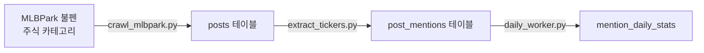
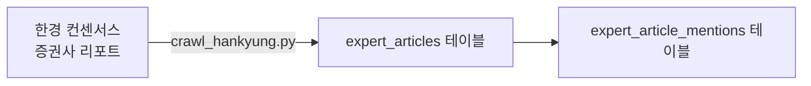

# Human Index - 프로젝트 구조

> 커뮤니티 언급량 기반 주식 투자 시그널 분석 플랫폼

## 개요

커뮤니티에서 언급되는 종목을 크롤링하여 DB화하고, **대중 의견(커뮤니티)**과 **전문가 의견(증권사 리포트)**을 교차 분석하여 투자 시그널을 제공합니다.

### 핵심 시나리오

1. **데이터 수집**: 매일 정해진 시간에 커뮤니티/증권사 리포트에서 게시글 제목 수집
2. **종목 추출 & 감성 분석**: 제목에서 종목을 추출하고 긍정/부정/중립 판정
3. **트렌드 분석**: 전주 대비 언급량 급상승 종목 감지, 대중 vs 전문가 감성 괴리 분석

### 기술 스택

| 구분 | 기술 |
|------|------|
| 대시보드 | Python + Streamlit |
| 데이터베이스 | PostgreSQL (human_index) |
| 크롤링 | Python (requests + BeautifulSoup) |
| 스케줄링 | macOS launchd |

---

## 디렉토리 구조

```
human-index/
│
├── app.py                              # Streamlit 앱 진입점 (사이드바 + 라우팅)
│
├── lib/                                # 대시보드 페이지 모듈
│   ├── __init__.py
│   ├── shared.py                       # 공통: DB 연결, run_query, navigate_to
│   ├── community.py                    # 📢 커뮤니티 페이지 (5개)
│   ├── expert.py                       # 🔬 전문가 페이지 (3개)
│   └── combined.py                     # 📊 종합 페이지 (2개)
│
├── scripts/                            # 데이터 수집 & 처리 스크립트
│   ├── daily_worker.py                 # 일일 파이프라인 (크롤링 → 종목추출 → 감성분석)
│   ├── crawl_mlbpark.py                # MLBPark 크롤러 (일일 모드)
│   ├── crawl_mlbpark_bulk.py           # MLBPark 벌크 크롤러 (초기 데이터 수집)
│   ├── crawl_hankyung.py               # 한경 컨센서스 크롤러 (증권사 리포트)
│   ├── extract_tickers.py              # 종목 추출 & 감성 분석
│   ├── import_tickers.py               # KRX/US 종목 마스터 임포트
│   └── recrawl_bulk.py                 # 벌크 재수집 (일회성)
│
├── docs/                               # 문서
│   ├── project-structure.md            # 프로젝트 구조 (이 문서)
│   ├── db-schema.md                    # 데이터베이스 스키마 설계
│   └── init-db.sql                     # DB 초기화 SQL
│
├── logs/                               # 크롤링 로그
│
├── com.humanindex.daily-worker.plist   # launchd: 커뮤니티 크롤링 (매일 09:00)
└── com.humanindex.hankyung-crawler.plist # launchd: 한경 리포트 크롤링 (매일 18:30)
```

---

## 대시보드 페이지 구성

### 📢 커뮤니티 (대중 의견) — `lib/community.py`

| 페이지 | 함수 | 설명 |
|--------|------|------|
| 📈 커뮤니티 개요 | `page_overview` | KPI, 일별 게시글/언급 추이, 감성 분포, TOP 10 종목 |
| 📊 언급량 랭킹 | `page_mention_ranking` | 종목별 언급 수, 감성 비율, 가중 점수 |
| 🚀 급상승 랭킹 | `page_surge_ranking` | 기간별 언급량 변화 (3일/7일/30일) |
| 👤 작성자 랭킹 | `page_author_ranking` | 활발한 작성자 순위 |
| 📋 게시글 목록 | `page_post_list` | 제목 검색, 종목 필터 |

### 🔬 전문가 (증권사 리포트) — `lib/expert.py`

| 페이지 | 함수 | 설명 |
|--------|------|------|
| 📈 전문가 개요 | `page_overview` | KPI, TOP 10 커버 종목, 증권사별 리포트 수 |
| 📊 리포트 랭킹 | `page_report_ranking` | 종목별 리포트 수, Buy/Hold/Sell 분포 |
| 📋 리포트 목록 | `page_report_list` | 증권사 필터, 제목 검색 |

### 📊 종합 (교차 분석) — `lib/combined.py`

| 페이지 | 함수 | 설명 |
|--------|------|------|
| 🏠 종합 대시보드 | `page_dashboard` | 커뮤니티 vs 전문가 감성 비교, 감성 괴리 분석 |
| 🔍 종목 검색 | `page_ticker_search` | 종목별 커뮤니티 추이 + 전문가 리포트 요약 |

---

## 데이터 수집 파이프라인

### 커뮤니티 (대중 의견)



- **실행 시간**: 매일 09:00 (`com.humanindex.daily-worker.plist`)
- **수집 범위**: 최근 3일 (주말/공휴일 대비, 중복 자동 스킵)

### 전문가 (증권사 리포트)



- **실행 시간**: 매일 18:30 (`com.humanindex.hankyung-crawler.plist`)
- **수집 항목**: 제목, 증권사, 작성자, 목표가, 투자의견

---

## 데이터베이스 구조

> 상세 스키마는 [db-schema.md](db-schema.md) 참조

### 주요 테이블

| 테이블 | 설명 | 소스 |
|--------|------|------|
| `communities` | 수집 대상 커뮤니티 | - |
| `posts` | 커뮤니티 게시글 | MLBPark |
| `tickers` | 종목 마스터 | KRX, 수동 등록 |
| `post_mentions` | 게시글 내 종목 언급 + 감성 | 자동 추출 |
| `mention_daily_stats` | 일별 종목 통계 | 집계 |
| `mention_trend_alerts` | 급상승 알림 | 집계 |
| `expert_sources` | 전문가 데이터 소스 | - |
| `expert_articles` | 증권사 리포트 | 한경 컨센서스 |
| `expert_article_mentions` | 리포트 내 종목 + 의견 | 자동 매칭 |

---

## 로컬 실행

```bash
# 대시보드 실행
streamlit run app.py

# 크롤링 수동 실행
python scripts/daily_worker.py          # 커뮤니티 전체 파이프라인
python scripts/crawl_hankyung.py        # 한경 리포트 수집

# 종목 마스터 업데이트
python scripts/import_tickers.py
```

---

## 자동 실행 (launchd)

| 서비스 | 시간 | plist |
|--------|------|-------|
| 커뮤니티 크롤링 | 매일 09:00 | `com.humanindex.daily-worker.plist` |
| 한경 리포트 크롤링 | 매일 18:30 | `com.humanindex.hankyung-crawler.plist` |

```bash
# 등록
launchctl load ~/Library/LaunchAgents/com.humanindex.daily-worker.plist
launchctl load ~/Library/LaunchAgents/com.humanindex.hankyung-crawler.plist

# 확인
launchctl list | grep humanindex
```
